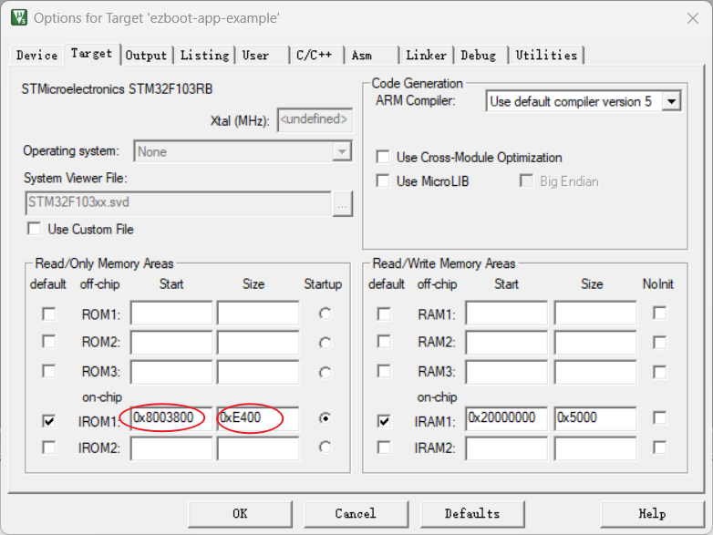
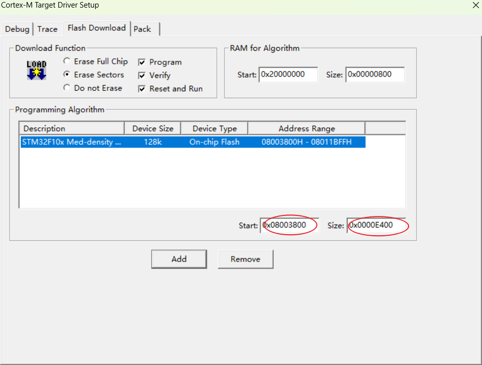
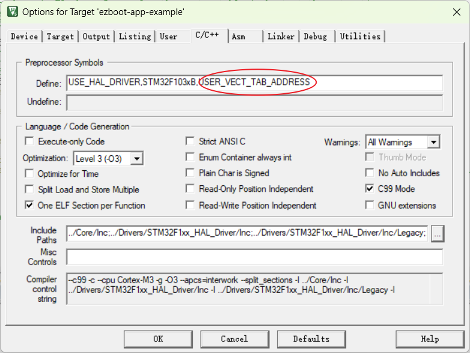
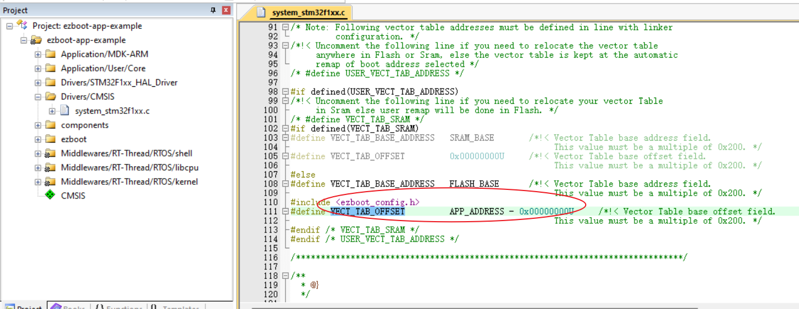
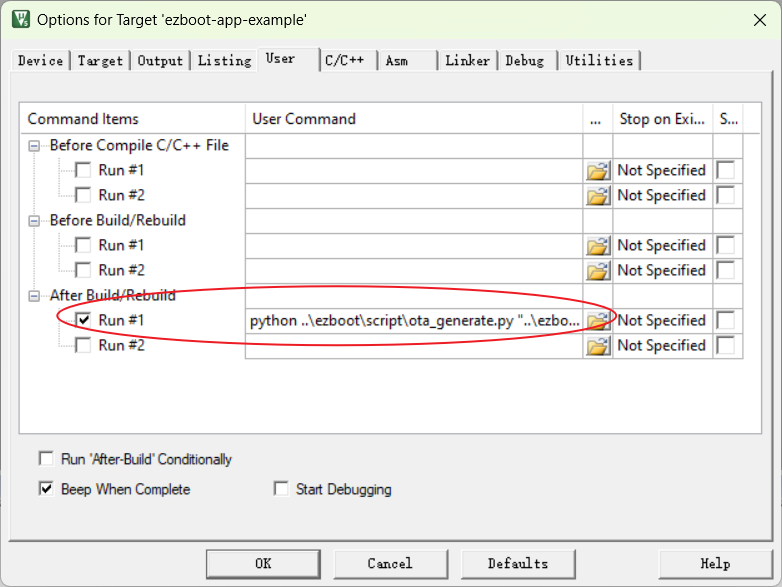
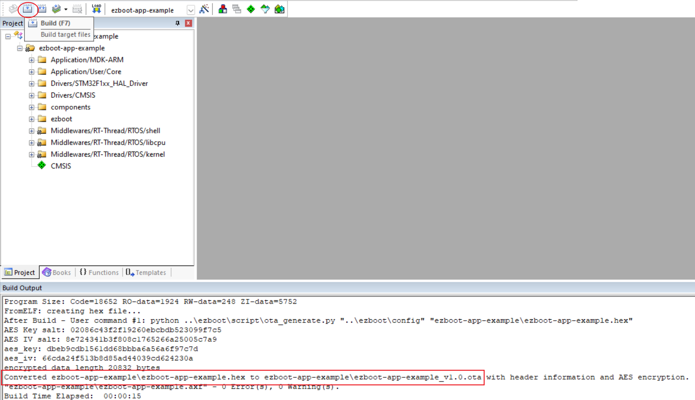

# APP适配指南

本文档描述如何将应用程序适配至EZBOOT框架，实现EZBOOT的正确引导和OTA升级功能。

------

## 步骤详解

### 1. 新建MCU工程

使用开发工具（如 Keil、STM32CubeMX 等）创建一个新的 MCU 工程，确保项目能够正常编译，并程序可正常运行。

------

### 2. 设置 Flash 起始地址和中断向量偏移量

以 STM32F103 为例，具体步骤如下：

#### 修改 Flash 起始地址和大小

1. 打开 Keil 的 **Options for Target -> Target**，在 **IROM1** 处调整 Flash 起始地址和大小，使其与 `ezboot_config.h` 中的字段定义 **APP_ADDRESS** 和 **APP_REGION_SIZE** 一致。
    

   (如果是 M0 内核系列芯片，需要占用RAM部分资源对中断向量进行重映射，因此还要调整 RAM 的起始地址和大小)

2. 若需要使用下载功能，在 **Options for Target -> Utilities -> Settings** 中设置 Flash 的起始地址和大小。
    

#### 设置中断向量偏移量

1. 在 **Options for Target -> C/C++ -> Define** 中添加字段定义 **USER_VECT_TAB_ADDRESS**。

2. 修改 `system_stm32f1xx.c` 文件中的字段 **VECT_TAB_OFFSET** 的值。
    
    

3. 对于 M0 内核系列芯片，无法使用以上方法，需使用以下代码进行中断向量表的 RAM 重映展：

   ```c
   for (int i = 0; i < 48; i++) {
       *((uint32_t*)(SRAM_BASE + (i << 2))) = *(__IO uint32_t*)(APP_ADDRESS + (i << 2));
   }
   __HAL_RCC_SYSCFG_CLK_ENABLE();
   __HAL_SYSCFG_REMAPMEMORY_SRAM();
   ```

------

### 3. 编译并验证固件

烧录程序至MCU，验证 EZBOOT 是否能够正确引导到应用程序并正常启动。

------

### 4. 新建 EZBOOT 目录

创建一个名为 **ezboot** 的目录，并将 EZBOOT 仓库中以下文件夹复制到该目录：

- **components**（包括 `ezb_flash` 和 `ota_mgr`，如需外部 Flash 支持，还需包含 `norflash`，其他文件可删除）
- **config**
- **porting**（适配到当前 MCU 的代码）
- **script**

------

### 5. 修改 `ezboot_config.h`

1. 删除字段定义 **CONFIG_LOG_LEVEL** 和 **CONFIG_TEST**。
2. 添加以下两个字段定义：
   - **CONFIG_DATA_VERSION**
   - **CONFIG_OTA_VERSION**

------

### 6. 添加 EZBOOT 代码文件

将 **ezboot** 目录内的所有代码文件添加到 MCU 工程中。

------

### 7. 调用 OTA 接口实现升级功能

在代码中调用 **ota_mgr** 接口实现 OTA 功能，具体步骤如下：

1. **初始化 OTA 管理程序**
    
    在程序初始化阶段调用 `ota_mgr_image_hw_init()`。
    
2. **擦除 OTA 镜像存储区域**

    在下载 OTA 文件前调用 `ota_mgr_image_erase()`。

3. **写入 OTA 镜像数据**

    下载 OTA 文件时调用 `ota_mgr_image_write()`，将文件内容写入 OTA 镜像存储区域。

4. **请求 OTA 升级**

    文件下载完成后，调用 `ota_mgr_state_set(OTA_REQUEST)` 向 EZBOOT 请求 OTA 升级，并执重启程序。

### 8.添加OTA文件生成脚本

在 **Options for Target -> C/C++ -> Define** 中添加脚本执行命令。（命令格式参考[README](../script/README.md)）

### 9.编译生成OTA文件

